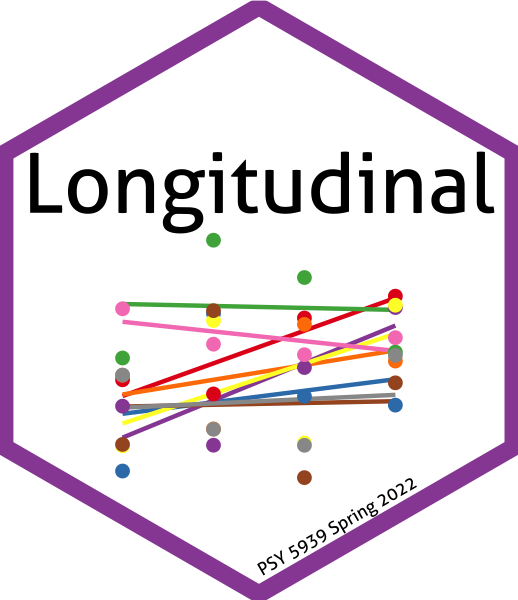

```{r setup, include=FALSE}
knitr::opts_chunk$set(echo = TRUE)
library(ggplot2)
theme_set(theme_classic(base_size = 20))
set.seed(31779)
```

{width=20%}

Week | HTML slides | PDF handout |
:----|:------------|:------------|
0    | [Long2022-0.html](Long2022-0.html) | [Long2022-0.pdf](Long2022-0.pdf)
1    | [Long2022-1.html](Long2022-1.html) | [Long2022-1.pdf](Long2022-1.pdf)
2    | [Long2022-2.html](Long2022-2.html) | [Long2022-2.pdf](Long2022-2.pdf)
3    | [Long2022-3.html](Long2022-3.html) | [Long2022-3.pdf](Long2022-3.pdf)
4    | [Long2022-4.html](Long2022-4.html) | [Long2022-4.pdf](Long2022-4.pdf)
5    | [Long2022-5.html](Long2022-5.html) | [Long2022-5.pdf](Long2022-5.pdf)
6    | [Long2022-6.html](Long2022-6.html) | [Long2022-6.pdf](Long2022-6.pdf)
7    | [Long2022-7.html](Long2022-7.html) | [Long2022-7.pdf](Long2022-7.pdf)
8    | [Long2022-8.html](Long2022-8.html) | [Long2022-8.pdf](Long2022-8.pdf)
9    | [Long2022-9.html](Long2022-9.html) | [Long2022-9.pdf](Long2022-9.pdf)
10   | [Long2022-10.html](Long2022-10.html) | [Long2022-10.pdf](Long2022-10.pdf)
11   | [Long2022-11.html](Long2022-11.html) | [Long2022-11.pdf](Long2022-11.pdf)
12   | [Long2022-12.html](Long2022-12.html) | [Long2022-12.pdf](Long2022-12.pdf)
13   | [Long2022-13.html](Long2022-13.html) | [Long2022-13.pdf](Long2022-13.pdf)


